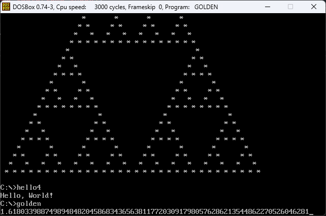

# Fart

True brainfuck assembler that generates binary from source for DOS.

(assembled brainfuck runs on DOSBox)

(fart edited for DOS)

## Informations

- Written in C99.
- Can handle maximum 2048 loop. (you can modify it from source.)
- Only has 4096 cell. (you can modify it from source.)
- Designed for 8086.

## Compiling

Go to `src/fart` and run `build.bat` or `build.sh` depend on your OS.

## Usage

- `fart [input] [output]`
- `fart e.bf EULER.COM`

## Special Thanks

- Thanks [Gülce](https://github.com/gulje) for helping me while debugging ❤️
- Thanks [Skeeto](https://github.com/skeeto/brainfuck-fart) for making a DOS version of fart ❤️

## License

Fart is licensed under the 3-Clause BSD License.
